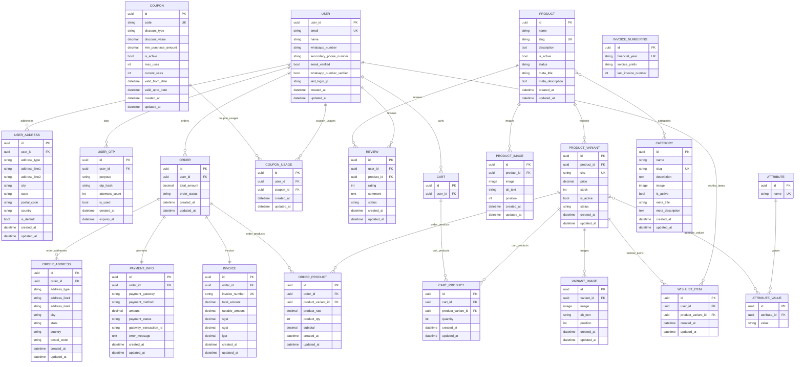

# Swaadishtha Data Model

```mermaid
erDiagram
    USER ||--o{ USER_ADDRESS : addresses
    USER ||--o{ USER_OTP : otps
    USER ||--o{ ORDER : orders
    USER ||--o{ COUPON_USAGE : coupon_usages
    USER ||--o{ REVIEW : reviews
    USER ||--o{ CART : carts
    USER ||--o{ WISHLIST_ITEM : wishlist_items

    PRODUCT ||--o{ PRODUCT_IMAGE : images
    PRODUCT ||--o{ PRODUCT_VARIANT : variants
    PRODUCT ||--o{ REVIEW : reviews
    PRODUCT }o--o{ CATEGORY : categories

    ATTRIBUTE ||--o{ ATTRIBUTE_VALUE : values
    PRODUCT_VARIANT }o--o{ ATTRIBUTE_VALUE : attribute_values
    PRODUCT_VARIANT ||--o{ VARIANT_IMAGE : images
    PRODUCT_VARIANT ||--o{ ORDER_PRODUCT : order_products
    PRODUCT_VARIANT ||--o{ CART_PRODUCT : cart_products
    PRODUCT_VARIANT ||--o{ WISHLIST_ITEM : wishlist_items

    ORDER ||--o{ ORDER_PRODUCT : order_products
    ORDER ||--o{ ORDER_ADDRESS : order_addresses
    ORDER ||--|| PAYMENT_INFO : payment
    ORDER ||--|| INVOICE : invoice

    CART ||--o{ CART_PRODUCT : cart_products

    COUPON ||--o{ COUPON_USAGE : coupon_usages

    USER {
        uuid user_id PK
        string email UK
        string name
        string whatsapp_number
        string secondary_phone_number
        bool email_verified
        bool whatsapp_number_verified
        string last_login_ip
        datetime created_at
        datetime updated_at
    }

    USER_ADDRESS {
        uuid id PK
        uuid user_id FK
        string address_type
        string address_line1
        string address_line2
        string city
        string state
        string postal_code
        string country
        bool is_default
        datetime created_at
        datetime updated_at
    }

    USER_OTP {
        uuid id PK
        uuid user_id FK
        string purpose
        string otp_hash
        int attempts_count
        bool is_used
        datetime created_at
        datetime expires_at
    }

    CATEGORY {
        uuid id PK
        string name
        string slug UK
        text description
        image image
        bool is_active
        string meta_title
        text meta_description
        datetime created_at
        datetime updated_at
    }

    PRODUCT {
        uuid id PK
        string name
        string slug UK
        text description
        bool is_active
        string status
        string meta_title
        text meta_description
        datetime created_at
        datetime updated_at
    }

    PRODUCT_IMAGE {
        uuid id PK
        uuid product_id FK
        image image
        string alt_text
        int position
        datetime created_at
        datetime updated_at
    }

    ATTRIBUTE {
        uuid id PK
        string name UK
    }

    ATTRIBUTE_VALUE {
        uuid id PK
        uuid attribute_id FK
        string value
    }

    PRODUCT_VARIANT {
        uuid id PK
        uuid product_id FK
        string sku UK
        decimal price
        int stock
        bool is_active
        string status
        datetime created_at
        datetime updated_at
    }

    VARIANT_IMAGE {
        uuid id PK
        uuid variant_id FK
        image image
        string alt_text
        int position
        datetime created_at
        datetime updated_at
    }

    ORDER {
        uuid id PK
        uuid user_id FK
        decimal total_amount
        string order_status
        datetime created_at
        datetime updated_at
    }

    ORDER_PRODUCT {
        uuid id PK
        uuid order_id FK
        uuid product_variant_id FK
        decimal product_rate
        int product_qty
        decimal subtotal
        datetime created_at
        datetime updated_at
    }

    ORDER_ADDRESS {
        uuid id PK
        uuid order_id FK
        string address_type
        string address_line1
        string address_line2
        string city
        string state
        string country
        string postal_code
        datetime created_at
        datetime updated_at
    }

    PAYMENT_INFO {
        uuid id PK
        uuid order_id FK
        string payment_gateway
        string payment_method
        decimal amount
        string payment_status
        string gateway_transaction_id
        text error_message
        datetime created_at
        datetime updated_at
    }

    INVOICE_NUMBERING {
        uuid id PK
        string financial_year UK
        string invoice_prefix
        int last_invoice_number
    }

    INVOICE {
        uuid id PK
        uuid order_id FK
        string invoice_number UK
        decimal total_amount
        decimal taxable_amount
        decimal sgst
        decimal cgst
        decimal igst
        datetime created_at
        datetime updated_at
    }

    CART {
        uuid id PK
        uuid user_id FK
    }

    CART_PRODUCT {
        uuid id PK
        uuid cart_id FK
        uuid product_variant_id FK
        int quantity
        datetime created_at
        datetime updated_at
    }

    WISHLIST_ITEM {
        uuid id PK
        uuid user_id FK
        uuid product_variant_id FK
        datetime created_at
        datetime updated_at
    }

    COUPON {
        uuid id PK
        string code UK
        string discount_type
        decimal discount_value
        decimal min_purchase_amount
        bool is_active
        int max_uses
        int current_uses
        datetime valid_from_date
        datetime valid_upto_date
        datetime created_at
        datetime updated_at
    }

    COUPON_USAGE {
        uuid id PK
        uuid user_id FK
        uuid coupon_id FK
        datetime created_at
        datetime updated_at
    }

    REVIEW {
        uuid id PK
        uuid user_id FK
        uuid product_id FK
        int rating
        text comment
        string status
        datetime created_at
        datetime updated_at
    }
```
